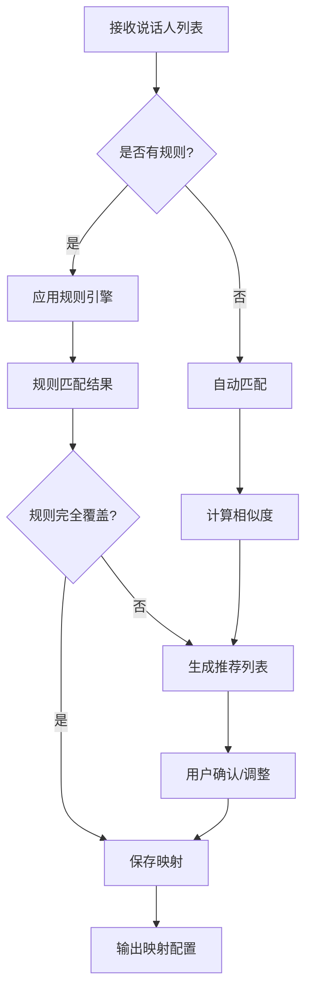

# ADR 0017: M06 说话人映射模块设计

## 状态

设计中

## 上下文

M06 负责将源视频中的说话人与目标音色进行智能匹配，是连接人物识别（M04/M05）和语音合成（M09）的关键桥梁。

## 模块职责

### 核心功能

1. **说话人-音色匹配**
   - 基于声音特征的自动匹配
   - 基于人物属性的规则匹配
   - 手动配置映射关系

2. **音色推荐**
   - 分析说话人声学特征
   - 推荐相似的目标音色
   - 展示匹配度评分

3. **映射关系管理**
   - 存储和维护映射配置
   - 支持批量映射操作
   - 版本控制和回滚

## 数据模型

### SpeakerMapping 表

```sql
CREATE TABLE speaker_mappings (
    id UUID PRIMARY KEY,
    job_id UUID NOT NULL REFERENCES jobs(id),
    source_speaker_id VARCHAR(255) NOT NULL,
    target_voice_id VARCHAR(255) NOT NULL,
    confidence FLOAT DEFAULT 0.0,
    mapping_method VARCHAR(50), -- 'auto', 'manual', 'rule'
    created_at TIMESTAMP DEFAULT CURRENT_TIMESTAMP,
    updated_at TIMESTAMP DEFAULT CURRENT_TIMESTAMP,
    UNIQUE(job_id, source_speaker_id)
);
```

### MappingRule 表

```sql
CREATE TABLE mapping_rules (
    id UUID PRIMARY KEY,
    user_id UUID REFERENCES users(id),
    priority INTEGER DEFAULT 0,
    condition JSONB NOT NULL, -- 匹配条件
    action JSONB NOT NULL,    -- 映射动作
    enabled BOOLEAN DEFAULT TRUE
);
```

## 算法设计

### 自动匹配算法

```python
def auto_match_speakers(speakers, available_voices):
    """
    自动匹配说话人和音色

    Args:
        speakers: 说话人列表 (包含声学特征)
        available_voices: 可用音色列表

    Returns:
        List[(speaker, voice, confidence)]: 匹配结果
    """
    matches = []

    for speaker in speakers:
        scores = []

        for voice in available_voices:
            # 计算相似度
            similarity = compute_similarity(
                speaker.embedding,
                voice.embedding
            )

            # 考虑属性匹配
            attribute_score = compute_attribute_match(
                speaker.attributes,
                voice.attributes
            )

            # 综合评分
            final_score = (
                0.7 * similarity +
                0.3 * attribute_score
            )

            scores.append((voice, final_score))

        # 选择最佳匹配
        best_voice, best_score = max(scores, key=lambda x: x[1])
        matches.append((speaker, best_voice, best_score))

    return matches
```

### 规则引擎

```python
class MappingRuleEngine:
    """映射规则引擎"""

    def __init__(self, rules):
        self.rules = sorted(rules, key=lambda r: r.priority, reverse=True)

    def apply(self, speaker, available_voices):
        """应用规则进行匹配"""
        for rule in self.rules:
            if self._matches_condition(speaker, rule.condition):
                return self._execute_action(rule.action, available_voices)
        return None

    def _matches_condition(self, speaker, condition):
        """检查是否匹配条件"""
        # 支持: gender, age_range, role, etc.
        for key, value in condition.items():
            if speaker.attributes.get(key) != value:
                return False
        return True

    def _execute_action(self, action, available_voices):
        """执行映射动作"""
        if action['type'] == 'specific_voice':
            return action['voice_id']
        elif action['type'] == 'voice_category':
            return select_from_category(available_voices, action['category'])
```

## API 设计

### 创建映射

```http
POST /api/jobs/{job_id}/speaker-mappings
Content-Type: application/json

{
    "mappings": [
        {
            "source_speaker_id": "spk_001",
            "target_voice_id": "voice_male_adult_01"
        },
        {
            "source_speaker_id": "spk_002",
            "target_voice_id": "voice_female_young_01"
        }
    ]
}
```

### 获取推荐音色

```http
GET /api/jobs/{job_id}/speaker-mappings/recommendations
```

响应:
```json
{
    "speaker_id": "spk_001",
    "recommendations": [
        {
            "voice_id": "voice_male_adult_01",
            "confidence": 0.92,
            "reason": "声学特征高度相似"
        },
        {
            "voice_id": "voice_male_adult_02",
            "confidence": 0.85,
            "reason": "性别年龄匹配"
        }
    ]
}
```

### 批量自动映射

```http
POST /api/jobs/{job_id}/speaker-mappings/auto-map
Content-Type: application/json

{
    "strategy": "similarity",  // 'similarity' | 'attribute' | 'hybrid'
    "min_confidence": 0.7
}
```

## 工作流程



## 输入输出

### 输入 Artifact

- **M05_SpeakerEmbeddings**: 说话人嵌入向量
- **M04_CharacterProfiles**: 人物属性信息
- **M09_VoiceLibrary**: 可用音色库

### 输出 Artifact

- **M06_SpeakerMappings**: 说话人-音色映射配置

## 依赖模块

- **M04**: 提供人物属性信息
- **M05**: 提供说话人嵌入和特征
- **M09**: 提供可用音色列表

## 质量保证

### 验证规则

1. 一致性: 每个说话人只能映射到一个音色
2. 完整性: 所有说话人都应有映射
3. 合理性: 映射应符合基本约束

### 质量指标

- 自动匹配准确率
- 用户修改率
- 匹配置信度分布
