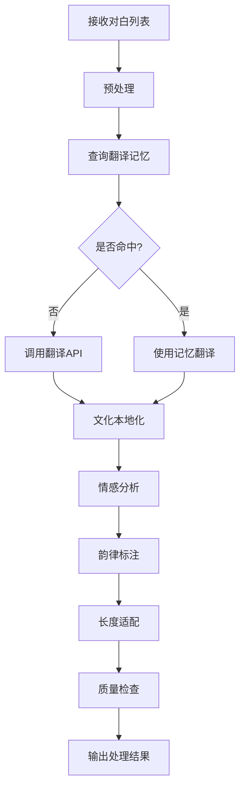

# ADR 0018: M07 对白智能处理模块设计

## 状态

设计中

## 上下文

M07 负责对白文本的智能处理，包括翻译、文化本地化、情感标记、韵律标注等，是整个配音流程的核心智能环节。

## 模块职责

### 核心功能

1. **文本翻译**
   - 多语言翻译引擎集成
   - 上下文感知翻译
   - 专业术语处理

2. **文化本地化**
   - 习语、梗、文化引用转换
   - 地区特色调整
   - 敏感内容处理

3. **情感标记**
   - 对白情感分析
   - 语气强度标记
   - 情绪转换建议

4. **韵律标注**
   - 断句位置标记
   - 重音位置标注
   - 语调建议

5. **长度适配**
   - 翻译长度控制
   - 语速调整建议
   - 文本压缩/扩展

## 数据模型

### ProcessedDialogue 表

```sql
CREATE TABLE processed_dialogues (
    id UUID PRIMARY KEY,
    job_id UUID NOT NULL REFERENCES jobs(id),
    source_line_id VARCHAR(255) NOT NULL,
    translated_text TEXT NOT NULL,
    original_text TEXT NOT NULL,

    -- 标记信息
    emotion_label VARCHAR(50),
    emotion_confidence FLOAT,
    prosody_markers JSONB,

    -- 元数据
    processing_version INTEGER DEFAULT 1,
    manual_reviewed BOOLEAN DEFAULT FALSE,
    created_at TIMESTAMP DEFAULT CURRENT_TIMESTAMP,
    updated_at TIMESTAMP DEFAULT CURRENT_TIMESTAMP
);
```

### TranslationMemory 表

```sql
CREATE TABLE translation_memory (
    id UUID PRIMARY KEY,
    user_id UUID REFERENCES users(id),
    source_text TEXT NOT NULL,
    target_text TEXT NOT NULL,
    source_lang VARCHAR(10),
    target_lang VARCHAR(10),
    context_hash VARCHAR(64),
    usage_count INTEGER DEFAULT 0,
    last_used_at TIMESTAMP,
    quality_score FLOAT,
    UNIQUE(user_id, source_text, target_text, context_hash)
);
```

## 算法设计

### 情感分析

```python
def analyze_emotion(dialogue, context):
    """
    分析对白的情感

    Args:
        dialogue: 对白文本
        context: 上下文信息 (场景、人物关系等)

    Returns:
        Dict: {emotion, confidence, intensity}
    """
    features = extract_features(dialogue, context)

    # 多维度分析
    text_emotion = nlp_emotion_model(dialogue)
    speaker_emotion = speaker_state_model(context.get('speaker_state'))
    scene_emotion = scene_emotion_model(context.get('scene_type'))

    # 融合
    final_emotion = fuse_emotions([
        text_emotion,
        speaker_emotion,
        scene_emotion
    ], weights=[0.5, 0.3, 0.2])

    return final_emotion
```

### 韵律标注

```python
def annotate_prosody(text, emotion, duration_constraint):
    """
    标注韵律信息

    Args:
        text: 文本
        emotion: 情感标签
        duration_constraint: 时长约束

    Returns:
        List[ProsodyUnit]: 韵律单元列表
    """
    units = []

    # 分词
    tokens = tokenize(text)

    # 语法分析
    syntax_tree = parse_syntax(tokens)

    # 标注韵律短语边界
    phrases = detect_prosody_phrases(syntax_tree, emotion)

    for phrase in phrases:
        # 标注重音
        stressed = detect_stress(phrase, emotion)

        # 计算预期时长
        expected_duration = estimate_duration(
            phrase,
            emotion,
            duration_constraint
        )

        units.append(ProsodyUnit(
            text=phrase.text,
            stress_positions=stressed,
            expected_duration=expected_duration,
            pitch_contour=suggest_pitch(emotion)
        ))

    return units
```

### 长度适配

```python
def adapt_length(text, target_duration, current_duration):
    """
    调整文本长度以适应时长

    Args:
        text: 翻译文本
        target_duration: 目标时长
        current_duration: 当前预估时长

    Returns:
        Tuple[str, float]: (调整后文本, 语速倍率)
    """
    ratio = target_duration / current_duration

    if 0.9 <= ratio <= 1.1:
        # 长度合适，微调语速
        return text, 1.0 / ratio

    elif ratio < 0.9:
        # 需要压缩
        compressed = compress_text(text, ratio)
        speed = 1.0
        return compressed, speed

    else:
        # 需要扩展或减速
        if ratio > 1.5:
            # 太长，需要删减
            trimmed = trim_text(text, ratio)
            speed = 1.0
        else:
            # 稍微减速
            trimmed = text
            speed = 1.0 / ratio

        return trimmed, speed
```

## API 设计

### 翻译对白

```http
POST /api/jobs/{job_id}/dialogues/translate
Content-Type: application/json

{
    "dialogues": [
        {
            "line_id": "line_001",
            "text": "Hello, how are you?",
            "speaker_id": "spk_001",
            "context": {...}
        }
    ],
    "target_language": "zh-CN",
    "options": {
        "preserve_emotion": true,
        "match_length": true,
        "cultural_adaptation": true
    }
}
```

### 获取翻译记忆

```http
GET /api/translation-memory
Query Parameters:
  - source_lang: 源语言
  - target_lang: 目标语言
  - text: 要查询的文本
```

### 批量情感分析

```http
POST /api/jobs/{job_id}/dialogues/analyze-emotion
```

## 工作流程



## 输入输出

### 输入 Artifact

- **M03_AlignedSubtitles**: 对齐的字幕文本
- **M05_AudioScenes**: 场景信息（辅助情感分析）
- **M04_CharacterProfiles**: 人物关系（辅助情感分析）

### 输出 Artifact

- **M07_ProcessedDialogues**: 处理后的对白（翻译+标注）

## 依赖模块

- **M03**: 提供原始对白文本
- **M04**: 提供人物关系信息
- **M05**: 提供场景情感信息

## 质量保证

### 验证规则

1. 完整性: 所有对白都应被处理
2. 对齐: 时间戳保持对齐
3. 连贯: 上下文对白连贯一致

### 质量指标

- 翻译准确率 (人工评估)
- 情感标注准确率
- 长度适配成功率
