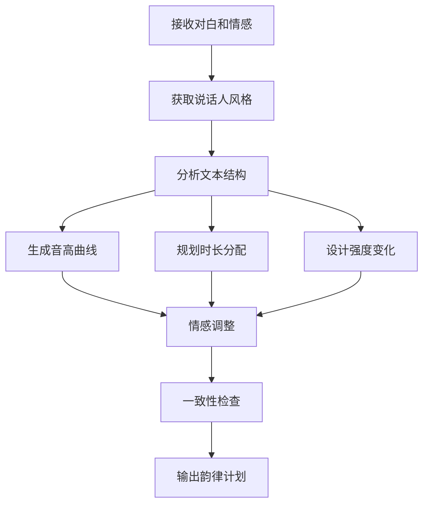

# ADR 0019: M08 韵律规划模块设计

## 状态

设计中

## 上下文

M08 负责为每句对白生成详细的韵律参数，控制合成语音的节奏、音高、强度等，确保配音的自然表达。

## 模块职责

### 核心功能

1. **韵律参数生成**
   - 生成音高曲线
   - 计算时长分配
   - 设置强度变化

2. **语流规划**
   - 句间停顿时长
   - 语速变化控制
   - 连读/断开位置

3. **情感表达**
   - 情感到韵律的映射
   - 强调位置标记
   - 语气类型选择

4. **说话人一致性**
   - 说话人风格建模
   - 跨句子一致性
   - 个性化调整

## 数据模型

### ProsodyPlan 表

```sql
CREATE TABLE prosody_plans (
    id UUID PRIMARY KEY,
    job_id UUID NOT NULL REFERENCES jobs(id),
    line_id VARCHAR(255) NOT NULL,
    speaker_id VARCHAR(255) NOT NULL,

    -- 韵律参数
    pitch_curve JSONB NOT NULL,      -- 音高曲线
    duration_map JSONB NOT NULL,      -- 时长映射
    intensity_curve JSONB NOT NULL,  -- 强度曲线

    -- 元数据
    emotion_label VARCHAR(50),
    speaking_rate FLOAT DEFAULT 1.0,
    pause_before_ms INTEGER DEFAULT 0,
    pause_after_ms INTEGER DEFAULT 0,

    created_at TIMESTAMP DEFAULT CURRENT_TIMESTAMP,
    UNIQUE(job_id, line_id)
);
```

### SpeakerStyle 表

```sql
CREATE TABLE speaker_styles (
    id UUID PRIMARY KEY,
    speaker_id VARCHAR(255) NOT NULL,
    job_id UUID REFERENCES jobs(id),

    -- 风格参数
    base_pitch FLOAT,
    pitch_range FLOAT,
    base_rate FLOAT,
    rate_variance FLOAT,
    pause_tendency JSONB,

    -- 学习来源
    learned_from_samples BOOLEAN DEFAULT FALSE,
    sample_count INTEGER DEFAULT 0,

    created_at TIMESTAMP DEFAULT CURRENT_TIMESTAMP,
    updated_at TIMESTAMP DEFAULT CURRENT_TIMESTAMP,
    UNIQUE(speaker_id, job_id)
);
```

## 算法设计

### 音高曲线生成

```python
def generate_pitch_curve(text, emotion, speaker_style):
    """
    生成音高曲线

    Args:
        text: 文本内容
        emotion: 情感标签
        speaker_style: 说话人风格

    Returns:
        List[Tuple[float, float]]: (时间, 音高值) 列表
    """
    # 基础音高
    base_pitch = speaker_style.base_pitch

    # 情感调整
    emotion_offset = get_emotion_pitch_offset(emotion)

    # 语法结构分析
    phrases = parse_phrases(text)
    accents = detect_accents(text)

    curve = []
    current_time = 0

    for phrase in phrases:
        # 短语内音高轮廓
        phrase_curve = generate_phrase_contour(
            phrase,
            base_pitch + emotion_offset,
            speaker_style.pitch_range
        )

        # 添加强调
        for accent in accents:
            if accent.position in phrase.time_range:
                phrase_curve = apply_accent(
                    phrase_curve,
                    accent.position,
                    accent.strength
                )

        curve.extend(phrase_curve)

    return smooth_curve(curve)
```

### 时长规划

```python
def plan_duration(tokens, target_duration, emotion, speaker_style):
    """
    规划各元素的时长

    Args:
        tokens: 词/音素列表
        target_duration: 目标总时长
        emotion: 情感标签
        speaker_style: 说话人风格

    Returns:
        Dict: 时长分配方案
    """
    # 基础时长模型
    base_durations = {
        token: estimate_base_duration(token)
        for token in tokens
    }

    # 情感调整
    emotion_factor = get_emotion_rate_factor(emotion)

    # 说话人调整
    speaker_factor = speaker_style.base_rate

    # 总时长
    total_base = sum(base_durations.values())
    target_total = target_duration

    # 计算缩放因子
    scale_factor = target_total / (total_base * emotion_factor * speaker_factor)

    # 应用缩放
    durations = {
        token: dur * scale_factor
        for token, dur in base_durations.items()
    }

    # 添加停顿
    pauses = calculate_pauses(tokens, emotion, speaker_style)

    return {
        'durations': durations,
        'pauses': pauses,
        'total': sum(durations.values()) + sum(pauses)
    }
```

### 说话人风格学习

```python
def learn_speaker_style(audio_samples, transcripts):
    """
    从样本学习说话人风格

    Args:
        audio_samples: 音频样本列表
        transcripts: 对应文本

    Returns:
        SpeakerStyle: 说话人风格参数
    """
    features = []

    for audio, text in zip(audio_samples, transcripts):
        # 提取韵律特征
        feature = extract_prosody_features(audio, text)
        features.append(feature)

    # 统计分析
    pitches = [f['pitch_mean'] for f in features]
    ranges = [f['pitch_range'] for f in features]
    rates = [f['speaking_rate'] for f in features]

    style = SpeakerStyle(
        base_pitch=np.mean(pitches),
        pitch_range=np.mean(ranges),
        base_rate=np.mean(rates),
        rate_variance=np.var(rates),
        pause_tendency=analyze_pause_patterns(features)
    )

    return style
```

## API 设计

### 生成韵律计划

```http
POST /api/jobs/{job_id}/prosody/plans
Content-Type: application/json

{
    "line_id": "line_001",
    "text": "你好，世界",
    "speaker_id": "spk_001",
    "emotion": "happy",
    "target_duration": 2.5,
    "context": {
        "is_emphasis": true,
        "is_question": false
    }
}
```

响应:
```json
{
    "pitch_curve": [[0.0, 200], [0.5, 220], [1.0, 180], ...],
    "duration_map": {"你": 0.3, "好": 0.4, "世": 0.3, "界": 0.5},
    "intensity_curve": [[0.0, 0.8], [0.5, 0.9], [1.0, 0.7], ...],
    "pauses": {"before": 100, "after": 150}
}
```

### 更新说话人风格

```http
POST /api/speakers/{speaker_id}/style
Content-Type: application/json

{
    "base_pitch": 220,
    "pitch_range": 50,
    "base_rate": 1.0
}
```

## 工作流程



## 输入输出

### 输入 Artifact

- **M07_ProcessedDialogues**: 处理后的对白（含情感标记）
- **M04_CharacterProfiles**: 人物信息
- **M05_SpeakerEmbeddings**: 说话人特征

### 输出 Artifact

- **M08_ProsodyPlans**: 韵律参数计划

## 依赖模块

- **M04**: 提供人物风格信息
- **M05**: 提供说话人特征
- **M07**: 提供情感标记

## 质量保证

### 验证规则

1. 时长匹配: 计划时长与目标时长误差 < 5%
2. 范围合理: 音高、强度在合理范围内
3. 连贯性: 相邻对白的韵律过渡自然

### 质量指标

- 韵律自然度评分
- 情感表达准确度
- 说话人一致性评分
