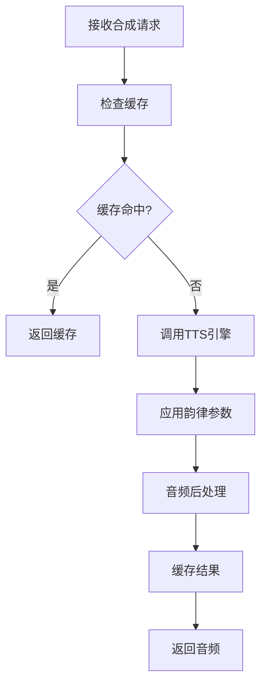

# ADR 0020: M10 音频处理模块设计

## 状态

设计中

## 上下文

M10 负责音频合成、音频处理和音频拼接，是生成最终配音音频的核心模块。

## 模块职责

### 核心功能

1. **语音合成**
   - 调用 TTS 引擎合成单句音频
   - 应用韵律参数
   - 批量合成调度

2. **音频处理**
   - 音频格式转换
   - 音量标准化
   - 降噪和增强
   - 混响添加

3. **音频拼接**
   - 按时间轴拼接音频片段
   - 添加停顿
   - 平滑过渡

4. **音画同步**
   - 精确时长控制
   - 延迟补偿
   - 同步验证

## 数据模型

### AudioSegment 表

```sql
CREATE TABLE audio_segments (
    id UUID PRIMARY KEY,
    job_id UUID NOT NULL REFERENCES jobs(id),
    line_id VARCHAR(255) NOT NULL,

    -- 文件信息
    file_path TEXT NOT NULL,
    format VARCHAR(20) NOT NULL,
    duration_ms INTEGER NOT NULL,
    sample_rate INTEGER NOT NULL,

    -- 合成参数
    voice_id VARCHAR(255),
    synthesis_params JSONB,

    -- 状态
    status VARCHAR(20) DEFAULT 'pending', -- 'pending' | 'processing' | 'completed' | 'failed'
    error_message TEXT,

    created_at TIMESTAMP DEFAULT CURRENT_TIMESTAMP,
    completed_at TIMESTAMP,
    UNIQUE(job_id, line_id)
);
```

### AudioMix 表

```sql
CREATE TABLE audio_mixes (
    id UUID PRIMARY KEY,
    job_id UUID NOT NULL REFERENCES jobs(id),
    project_id UUID REFERENCES projects(id),

    -- 输出文件
    output_path TEXT NOT NULL,
    format VARCHAR(20) DEFAULT 'wav',
    duration_ms INTEGER NOT NULL,

    -- 处理参数
    normalize_gain FLOAT,
    noise_reduction_level INTEGER,
    reverb_params JSONB,

    -- 质量指标
    loudness_lufs FLOAT,
    peak_dbfs FLOAT,
    dynamic_range FLOAT,

    status VARCHAR(20) DEFAULT 'pending',
    created_at TIMESTAMP DEFAULT CURRENT_TIMESTAMP,
    completed_at TIMESTAMP
);
```

## 算法设计

### 批量合成调度

```python
class BatchSynthesisScheduler:
    """批量语音合成调度器"""

    def __init__(self, max_concurrent=10):
        self.max_concurrent = max_concurrent
        self.queue = []
        self.running = []
        self.completed = []

    def schedule(self, requests):
        """调度合成任务"""
        # 按说话人分组（同说话人可以合并请求）
        grouped = self._group_by_voice(requests)

        for voice_id, reqs in grouped.items():
            # 按优先级排序
            sorted_reqs = sorted(reqs, key=lambda r: r.priority)

            for req in sorted_reqs:
                self.queue.append(req)

        # 执行调度
        return self._execute()

    def _execute(self):
        """执行调度"""
        results = []

        while self.queue or self.running:
            # 启动新任务
            while len(self.running) < self.max_concurrent and self.queue:
                task = self.queue.pop(0)
                future = self._start_task(task)
                self.running.append((task, future))

            # 等待完成
            for task, future in self.running[:]:
                if future.done():
                    result = future.result()
                    results.append(result)
                    self.running.remove((task, future))
                    self.completed.append(task)

        return results
```

### 音频拼接

```python
def assemble_audio(segments, timeline, spacing_config):
    """
    拼接音频片段

    Args:
        segments: 音频片段列表 (路径, 时长)
        timeline: 时间轴配置
        spacing_config: 间隔配置

    Returns:
        str: 拼接后的音频文件路径
    """
    # 创建空白音轨
    total_duration = timeline['end_time']
    output = AudioSegment.silent(duration=total_duration)

    for segment in segments:
        # 加载音频
        audio = AudioSegment.from_file(segment['path'])

        # 应用间隔
        spacing = spacing_config.get(
            segment.get('spacing_type', 'default'),
            0
        )

        # 定位
        position = segment['start_time'] * 1000  # 转毫秒

        # 添加间隔
        if spacing > 0:
            audio = audio + AudioSegment.silent(duration=spacing)

        # 叠加
        output = output.overlay(audio, position=position)

    return export_audio(output)
```

### 音量标准化

```python
def normalize_audio(audio, target_lufs=-16.0):
    """
    标准化音量到目标 LUFS

    Args:
        audio: 音频数据
        target_lufs: 目标响度 (EBU R128 标准)

    Returns:
        AudioSegment: 标准化后的音频
    """
    # 测量当前响度
    current_lufs = measure_loudness(audio)

    # 计算增益
    gain_db = target_lufs - current_lufs

    # 限制增益范围
    gain_db = np.clip(gain_db, -20, 20)

    # 应用增益
    normalized = audio.apply_gain(gain_db)

    # 验证
    final_lufs = measure_loudness(normalized)
    assert abs(final_lufs - target_lufs) < 1.0

    return normalized
```

## API 设计

### 合成单句

```http
POST /api/jobs/{job_id}/audio/synthesize
Content-Type: application/json

{
    "line_id": "line_001",
    "text": "你好，世界",
    "voice_id": "voice_001",
    "prosody": {
        "pitch_curve": [...],
        "speaking_rate": 1.0
    }
}
```

### 批量合成

```http
POST /api/jobs/{job_id}/audio/batch-synthesize
Content-Type: application/json

{
    "lines": [
        {"line_id": "line_001", "text": "...", "voice_id": "..."},
        {"line_id": "line_002", "text": "...", "voice_id": "..."}
    ]
}
```

### 拼接音频

```http
POST /api/jobs/{job_id}/audio/assemble
Content-Type: application/json

{
    "segment_ids": ["seg_001", "seg_002", "seg_003"],
    "spacing_config": {
        "between_sentences": 200,
        "between_scenes": 500
    }
}
```

### 音频处理

```http
POST /api/jobs/{job_id}/audio/process
Content-Type: application/json

{
    "input_path": "/path/to/input.wav",
    "operations": [
        {"type": "normalize", "target_lufs": -16},
        {"type": "denoise", "level": 0.5},
        {"type": "reverb", "room_size": "medium"}
    ]
}
```

## 工作流程



## 输入输出

### 输入 Artifact

- **M07_ProcessedDialogues**: 翻译文本
- **M08_ProsodyPlans**: 韵律参数
- **M06_SpeakerMappings**: 音色映射

### 输出 Artifact

- **M10_SynthesizedAudio**: 合成的音频文件
- **M10_AssembledAudio**: 拼接后的完整音频

## 依赖模块

- **M06**: 提供音色映射
- **M07**: 提供翻译文本
- **M08**: 提供韵律参数

## 质量保证

### 验证规则

1. 时长精度: 合成音频时长误差 < 100ms
2. 音质标准: 采样率 ≥ 44.1kHz，比特率 ≥ 128kbps
3. 响度标准: 符合 EBU R128 标准

### 质量指标

- 合成成功率
- 平均合成时间
- 音质评分
- 同步精度
