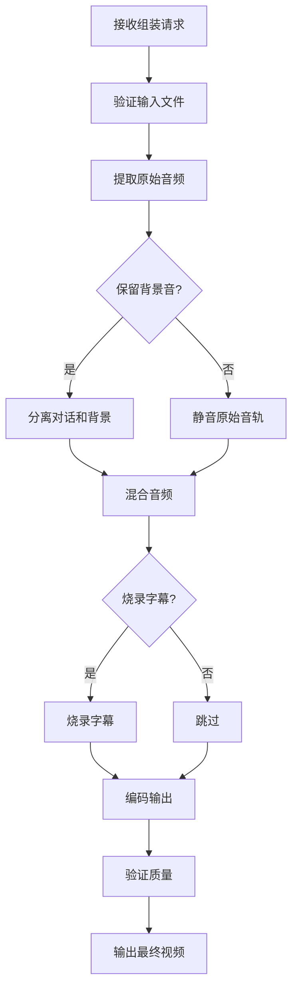

# ADR 0021: M11 视频组装模块设计

## 状态

设计中

## 上下文

M11 负责将配音音频与原始视频结合，生成最终的视频文件，是整个流程的最后一步。

## 模块职责

### 核心功能

1. **音频替换**
   - 提取原始音频轨道
   - 替换为配音音频
   - 保留背景音/音乐（可选）

2. **字幕烧录**
   - 将翻译字幕烧录到视频
   - 字幕样式自定义
   - 位置和时机控制

3. **视频编码**
   - 多种输出格式支持
   - 分辨率调整
   - 码率控制

4. **质量保证**
   - 音画同步验证
   - 质量检查
   - 完整性验证

## 数据模型

### VideoAssembly 表

```sql
CREATE TABLE video_assemblies (
    id UUID PRIMARY KEY,
    job_id UUID NOT NULL REFERENCES jobs(id),
    project_id UUID REFERENCES projects(id),

    -- 输入
    source_video_path TEXT NOT NULL,
    dubbed_audio_path TEXT NOT NULL,
    subtitle_path TEXT,

    -- 输出
    output_path TEXT NOT NULL,
    format VARCHAR(20) DEFAULT 'mp4',
    resolution VARCHAR(20),

    -- 编码参数
    video_codec VARCHAR(20) DEFAULT 'h264',
    audio_codec VARCHAR(20) DEFAULT 'aac',
    video_bitrate INTEGER,
    audio_bitrate INTEGER,

    -- 状态
    status VARCHAR(20) DEFAULT 'pending',
    progress FLOAT DEFAULT 0,
    error_message TEXT,

    -- 质量指标
    sync_accuracy FLOAT,
    output_quality_score FLOAT,

    created_at TIMESTAMP DEFAULT CURRENT_TIMESTAMP,
    completed_at TIMESTAMP
);
```

## 算法设计

### 音频混合

```python
def mix_audio_tracks(original_audio, dubbed_audio, config):
    """
    混合原始音频和配音音频

    Args:
        original_audio: 原始音频
        dubbed_audio: 配音音频
        config: 混合配置

    Returns:
        AudioSegment: 混合后的音频
    """
    result = AudioSegment.silent(duration=0)

    # 背景音（降低音量）
    if config.preserve_background:
        bg_volume = config.background_volume_db
        background = original_audio - bg_volume
    else:
        background = AudioSegment.silent(duration=len(original_audio))

    # 配音音轨
    dialogue = dubbed_audio

    # 混合
    result = background.overlay(dialogue)

    # 标准化
    if config.normalize:
        result = normalize_audio(result, target_lufs=-16.0)

    return result
```

### 字幕烧录

```python
def burn_subtitles(video, subtitles, style_config):
    """
    将字幕烧录到视频

    Args:
        video: 视频文件
        subtitles: 字幕列表 (时间轴, 文本)
        style_config: 字幕样式

    Returns:
        str: 输出视频路径
    """
    # 使用 FFmpeg 或 subtitle 编辑库

    filters = []

    # 字幕样式
    style = {
        'fontsize': style_config.font_size,
        'fontcolor': style_config.font_color,
        'outlinecolor': style_config.outline_color,
        'alignment': style_config.alignment,
        'margin_v': style_config.margin_bottom
    }

    # 构建字幕文件（ASS 格式）
    ass_file = create_ass_file(subtitles, style)

    # FFmpeg 命令
    cmd = [
        'ffmpeg', '-i', video,
        '-vf', f"ass={ass_file}",
        '-c:a', 'copy',
        output_path
    ]

    execute(cmd)
    return output_path
```

### 音画同步验证

```python
def verify_sync(video_path, expected_timeline):
    """
    验证音画同步

    Args:
        video_path: 视频文件
        expected_timeline: 预期时间轴

    Returns:
        Dict: 同步分析结果
    """
    # 提取音频
    audio = extract_audio(video_path)

    # 检测关键点
    sync_points = detect_sync_points(audio)

    # 与预期对比
    errors = []
    for point in expected_timeline:
        actual = find_closest_point(sync_points, point['time'])
        offset = abs(actual - point['time'])

        if offset > MAX_SYNC_ERROR:
            errors.append({
                'expected': point['time'],
                'actual': actual,
                'offset': offset,
                'line_id': point.get('line_id')
            })

    return {
        'is_synced': len(errors) == 0,
        'max_offset': max(e['offset'] for e in errors) if errors else 0,
        'errors': errors
    }
```

## API 设计

### 创建组装任务

```http
POST /api/jobs/{job_id}/video/assembly
Content-Type: application/json

{
    "source_video": "/path/to/source.mp4",
    "dubbed_audio": "/path/to/dubbed.wav",
    "subtitle_file": "/path/to/subtitle.ass",
    "options": {
        "preserve_background": true,
        "background_volume_db": 20,
        "burn_subtitles": true,
        "subtitle_style": {
            "font_size": 24,
            "font_color": "white",
            "margin_bottom": 50
        },
        "output_format": "mp4",
        "video_bitrate": 2000,
        "audio_bitrate": 192
    }
}
```

### 查询进度

```http
GET /api/jobs/{job_id}/video/assembly/status
```

响应:
```json
{
    "status": "processing",
    "progress": 0.65,
    "current_step": "encoding",
    "eta_seconds": 120
}
```

### 获取输出

```http
GET /api/jobs/{job_id}/video/output
```

## 工作流程



## 输入输出

### 输入 Artifact

- **M01_SourceVideo**: 原始视频文件
- **M10_AssembledAudio**: 配音音频
- **M03_AlignedSubtitles**: 字幕文件（可选）

### 输出 Artifact

- **M11_FinalVideo**: 最终视频文件

## 依赖模块

- **M01**: 提供原始视频
- **M03**: 提供字幕文件
- **M10**: 提供配音音频

## 质量保证

### 验证规则

1. 音画同步: 偏差 < 100ms
2. 格式兼容: 输出格式符合要求
3. 文件完整: 可以正常播放

### 质量指标

- 同步精度
- 视频质量评分
- 音频质量评分
- 处理成功率

## 性能优化

1. 硬件加速: 使用 GPU 加速编码
2. 分段处理: 长视频分段处理
3. 缓存中间结果
4. 并行处理: 多任务并行
