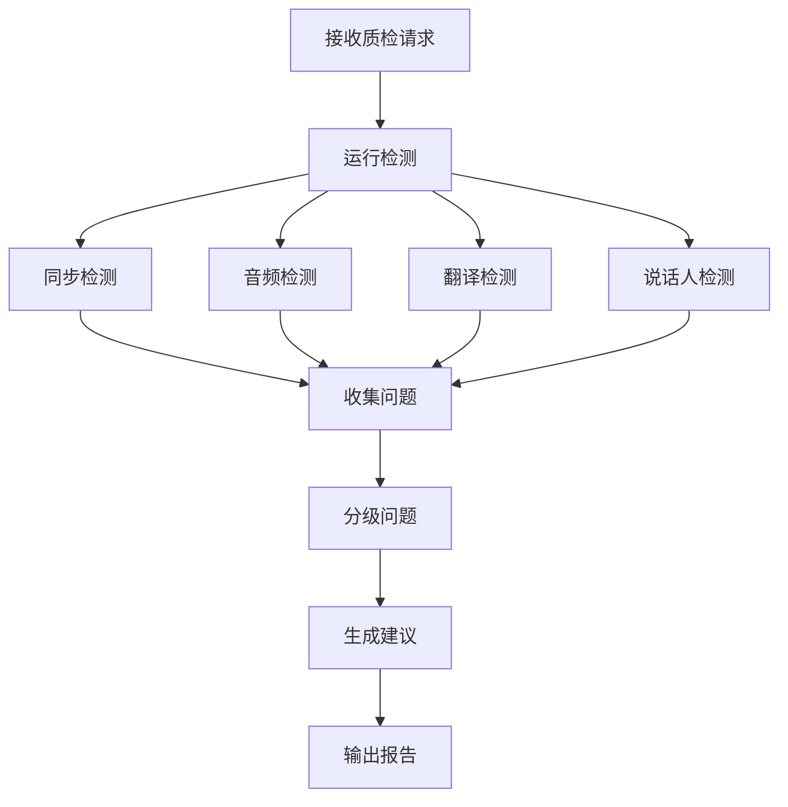

# ADR 0022: M12 质检模块设计

## 状态

设计中

## 上下文

M12 负责对配音结果进行全面质量检查，发现问题并提供反馈，确保最终输出质量。

## 模块职责

### 核心功能

1. **音画同步检查**
   - 音频延迟检测
   - 口型匹配验证
   - 关键点对齐检查

2. **音频质量检查**
   - 音质评分
   - 噪声检测
   - 音量一致性

3. **翻译质量检查**
   - 准确性验证
   - 流畅度检查
   - 文化适配评估

4. **说话人一致性**
   - 音色一致性
   - 风格一致性
   - 错误检测（说话人混淆）

5. **问题报告**
   - 自动生成问题列表
   - 严重程度分级
   - 修复建议

## 数据模型

### QualityIssue 表

```sql
CREATE TABLE quality_issues (
    id UUID PRIMARY KEY,
    job_id UUID NOT NULL REFERENCES jobs(id),

    -- 问题描述
    issue_type VARCHAR(50) NOT NULL,
    severity VARCHAR(20) NOT NULL, -- 'critical' | 'major' | 'minor'
    category VARCHAR(50),
    description TEXT NOT NULL,

    -- 位置信息
    line_id VARCHAR(255),
    time_range_start_ms INTEGER,
    time_range_end_ms INTEGER,

    -- 检测信息
    detector VARCHAR(50),
    confidence FLOAT,
    metadata JSONB,

    -- 状态
    status VARCHAR(20) DEFAULT 'open', -- 'open' | 'confirmed' | 'false_positive' | 'fixed'
    fix_suggestion TEXT,

    -- 分配
    assigned_to VARCHAR(100),

    created_at TIMESTAMP DEFAULT CURRENT_TIMESTAMP,
    updated_at TIMESTAMP DEFAULT CURRENT_TIMESTAMP
);
```

### QualityReport 表

```sql
CREATE TABLE quality_reports (
    id UUID PRIMARY KEY,
    job_id UUID NOT NULL REFERENCES jobs(id),

    -- 总体评分
    overall_score FLOAT NOT NULL,
    sync_score FLOAT,
    audio_score FLOAT,
    translation_score FLOAT,
    speaker_score FLOAT,

    -- 问题统计
    total_issues INTEGER DEFAULT 0,
    critical_count INTEGER DEFAULT 0,
    major_count INTEGER DEFAULT 0,
    minor_count INTEGER DEFAULT 0,

    -- 详情
    report_data JSONB,

    created_at TIMESTAMP DEFAULT CURRENT_TIMESTAMP
);
```

## 算法设计

### 音画同步检测

```python
def detect_audio_video_sync(video_path, reference_timeline):
    """
    检测音画同步问题

    Args:
        video_path: 视频文件
        reference_timeline: 参考时间轴

    Returns:
        List[SyncIssue]: 同步问题列表
    """
    issues = []

    # 提取音频
    audio = extract_audio(video_path)

    # 检测能量峰值
    peaks = detect_energy_peaks(audio)

    # 与参考对比
    for ref_point in reference_timeline:
        nearest_peak = find_nearest_peak(peaks, ref_point['time'])
        offset = nearest_peak['time'] - ref_point['time']

        if abs(offset) > SYNC_THRESHOLD:
            issues.append(SyncIssue(
                time=ref_point['time'],
                offset=offset,
                severity=get_sync_severity(offset),
                line_id=ref_point.get('line_id')
            ))

    return issues
```

### 音质检测

```python
def analyze_audio_quality(audio_path):
    """
    分析音频质量

    Args:
        audio_path: 音频文件

    Returns:
        Dict: 质量分析结果
    """
    audio = load_audio(audio_path)

    results = {}

    # 1. 噪声检测
    noise_level = estimate_noise_level(audio)
    results['noise_level'] = noise_level
    results['has_noise'] = noise_level > NOISE_THRESHOLD

    # 2. 削波检测
    clipping = detect_clipping(audio)
    results['clipping_percentage'] = clipping

    # 3. 音量一致性
    loudness = measure_loudness(audio)
    dynamics = measure_dynamic_range(audio)
    results['loudness'] = loudness
    results['dynamic_range'] = dynamics

    # 4. 综合评分
    score = calculate_audio_score(results)
    results['overall_score'] = score

    return results
```

### 说话人一致性检查

```python
def check_speaker_consistency(segments, speaker_mapping):
    """
    检查说话人一致性

    Args:
        segments: 音频片段列表
        speaker_mapping: 说话人-音色映射

    Returns:
        List[SpeakerIssue]: 一致性问题
    """
    issues = []

    for segment in segments:
        expected_voice = speaker_mapping.get(segment['speaker_id'])

        # 验证音色
        detected_voice = identify_voice(segment['audio'])

        if detected_voice != expected_voice:
            issues.append(SpeakerIssue(
                segment_id=segment['id'],
                expected=expected_voice,
                detected=detected_voice,
                confidence=segment['confidence']
            ))

    return issues
```

### 翻译质量评估

```python
def evaluate_translation_quality(source_text, translated_text, context):
    """
    评估翻译质量

    Args:
        source_text: 原文
        translated_text: 译文
        context: 上下文信息

    Returns:
        Dict: 质量评估结果
    """
    results = {}

    # 1. 准确性
    accuracy = semantic_similarity(source_text, translated_text)
    results['accuracy_score'] = accuracy

    # 2. 流畅度
    fluency = measure_fluency(translated_text)
    results['fluency_score'] = fluency

    # 3. 情感保留
    emotion_preserved = compare_emotion(
        source_text,
        translated_text,
        context
    )
    results['emotion_preserved'] = emotion_preserved

    # 4. 综合评分
    results['overall_score'] = (
        0.5 * accuracy +
        0.3 * fluency +
        0.2 * emotion_preserved
    )

    return results
```

## API 设计

### 运行质检

```http
POST /api/jobs/{job_id}/quality/run
Content-Type: application/json

{
    "checks": [
        "sync",
        "audio_quality",
        "translation",
        "speaker_consistency"
    ],
    "options": {
        "strict_mode": false,
        "thresholds": {
            "sync_offset_ms": 100,
            "noise_level": 0.1
        }
    }
}
```

响应:
```json
{
    "report_id": "qr_001",
    "overall_score": 0.92,
    "scores": {
        "sync": 0.95,
        "audio": 0.88,
        "translation": 0.94,
        "speaker": 0.90
    },
    "issues": [
        {
            "id": "issue_001",
            "type": "sync",
            "severity": "major",
            "time": 123.45,
            "offset_ms": 150
        }
    ]
}
```

### 获取问题列表

```http
GET /api/jobs/{job_id}/quality/issues
Query Parameters:
  - severity: critical | major | minor
  - status: open | confirmed | fixed
  - type: sync | audio | translation | speaker
```

### 更新问题状态

```http
PATCH /api/quality/issues/{issue_id}
Content-Type: application/json

{
    "status": "fixed",
    "note": "Adjusted audio offset by 150ms"
}
```

### 生成质检报告

```http
POST /api/jobs/{job_id}/quality/report
Content-Type: application/json

{
    "include_details": true,
    "format": "pdf"  // 'json' | 'pdf'
}
```

## 工作流程



## 输入输出

### 输入 Artifact

- **M11_FinalVideo**: 最终视频
- **M10_AssembledAudio**: 音频
- **M07_ProcessedDialogues**: 翻译文本
- **M06_SpeakerMappings**: 说话人映射

### 输出 Artifact

- **M12_QualityReport**: 质检报告

## 依赖模块

- **M10**: 音频检查
- **M11**: 视频检查
- **M07**: 翻译检查

## 质量保证

### 检测精度

- 同步检测精度: ±50ms
- 噪声检测准确率: >90%
- 说话人识别准确率: >95%

### 验证规则

1. 不遗漏严重问题
2. 误报率 < 10%
3. 建议可操作性

## 问题分类

| 类别 | 严重程度 | 示例 |
|------|----------|------|
| Critical | 音画完全不同步 | 偏差 > 500ms |
| Major | 明显质量问题 | 音频缺失、说话人错误 |
| Minor | 细节问题 | 轻微噪声、小瑕疵 |
