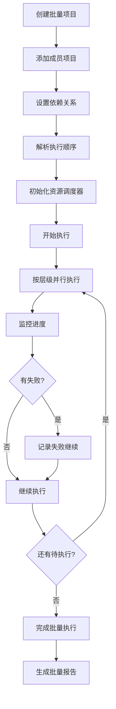

# ADR 0023: M13 批量流水线模块设计

## 状态

设计中

## 上下文

M13 负责批量处理多个项目，提供高效的流水线管理，是面向企业用户和内容创作者的核心功能。

## 模块职责

### 核心功能

1. **批量项目管理**
   - 创建批量项目组
   - 项目依赖管理
   - 批量操作调度

2. **流水线编排**
   - 多项目并行执行
   - 资源分配和限制
   - 优先级调度

3. **进度追踪**
   - 整体进度统计
   - 单项目状态追踪
   - ETA 计算

4. **批量配置**
   - 统一配置模板
   - 项目级别覆盖
   - 配置验证

5. **批量输出**
   - 统一输出管理
   - 批量下载打包
   - 分发集成

## 数据模型

### BatchProject 表

```sql
CREATE TABLE batch_projects (
    id UUID PRIMARY KEY,
    user_id UUID REFERENCES users(id),

    -- 基本信息
    name VARCHAR(255) NOT NULL,
    description TEXT,
    status VARCHAR(20) DEFAULT 'pending',

    -- 配置
    config JSONB NOT NULL,
    default_options JSONB,

    -- 统计
    total_projects INTEGER DEFAULT 0,
    completed_projects INTEGER DEFAULT 0,
    failed_projects INTEGER DEFAULT 0,

    -- 资源限制
    max_parallel_jobs INTEGER DEFAULT 5,
    priority INTEGER DEFAULT 0,

    created_at TIMESTAMP DEFAULT CURRENT_TIMESTAMP,
    started_at TIMESTAMP,
    completed_at TIMESTAMP
);
```

### BatchProjectMember 表

```sql
CREATE TABLE batch_project_members (
    id UUID PRIMARY KEY,
    batch_id UUID NOT NULL REFERENCES batch_projects(id),
    project_id UUID REFERENCES projects(id),
    job_id UUID REFERENCES jobs(id),

    -- 项目特定配置
    options JSONB,

    -- 状态
    status VARCHAR(20) DEFAULT 'pending',
    progress FLOAT DEFAULT 0,

    -- 依赖
    depends_on UUID[],  -- 依赖的其他 member ID
    dependencies_resolved BOOLEAN DEFAULT FALSE,

    -- 结果
    result_artifact_id UUID,

    created_at TIMESTAMP DEFAULT CURRENT_TIMESTAMP,
    completed_at TIMESTAMP,
    UNIQUE(batch_id, project_id)
);
```

### PipelineExecution 表

```sql
CREATE TABLE pipeline_executions (
    id UUID PRIMARY KEY,
    batch_id UUID REFERENCES batch_projects(id),

    -- 执行信息
    executor_id VARCHAR(100),
    status VARCHAR(20) DEFAULT 'running',

    -- 统计
    total_tasks INTEGER DEFAULT 0,
    completed_tasks INTEGER DEFAULT 0,
    failed_tasks INTEGER DEFAULT 0,

    -- 资源使用
    peak_resource_usage JSONB,
    average_resource_usage JSONB,

    started_at TIMESTAMP DEFAULT CURRENT_TIMESTAMP,
    completed_at TIMESTAMP
);
```

## 算法设计

### 依赖解析

```python
class DependencyResolver:
    """依赖关系解析器"""

    def __init__(self, members):
        self.members = members
        self.graph = self._build_graph()

    def _build_graph(self):
        """构建依赖图"""
        graph = {m.id: [] for m in self.members}

        for member in self.members:
            for dep_id in member.depends_on:
                if dep_id in graph:
                    graph[dep_id].append(member.id)

        return graph

    def resolve_execution_order(self):
        """解析执行顺序"""
        # 拓扑排序
        visited = set()
        order = []

        def visit(node_id):
            if node_id in visited:
                return
            visited.add(node_id)

            for dependent in self.graph.get(node_id, []):
                visit(dependent)

            order.append(node_id)

        for node_id in self.graph:
            if node_id not in visited:
                visit(node_id)

        # 按"依赖数"分组 - 可并行的在同一层
        levels = []
        remaining = set(order)

        while remaining:
            # 找出所有依赖已满足的
            ready = [
                m_id for m_id in remaining
                if all(dep not in remaining for dep in self._get_deps(m_id))
            ]
            levels.append(ready)
            remaining -= set(ready)

        return levels

    def _get_deps(self, member_id):
        """获取成员的依赖"""
        member = next(m for m in self.members if m.id == member_id)
        return member.depends_on or []
```

### 资源分配调度

```python
class ResourceScheduler:
    """资源分配调度器"""

    def __init__(self, max_parallel=5, resources=None):
        self.max_parallel = max_parallel
        self.resources = resources or {
            'cpu': 100,
            'memory': 100,  # GB
            'gpu': 1
        }
        self.allocations = {}

    def can_allocate(self, task_resources):
        """检查是否可以分配资源"""
        # 并行数检查
        if len(self.allocations) >= self.max_parallel:
            return False

        # 资源检查
        for resource, amount in self.resources.items():
            used = sum(a.get(resource, 0) for a in self.allocations.values())
            if used + task_resources.get(resource, 0) > amount:
                return False

        return True

    def allocate(self, task_id, resources):
        """分配资源"""
        if not self.can_allocate(resources):
            raise ResourceError("Insufficient resources")

        self.allocations[task_id] = resources

    def release(self, task_id):
        """释放资源"""
        self.allocations.pop(task_id, None)

    def get_available(self):
        """获取可用资源"""
        available = {}
        for resource, amount in self.resources.items():
            used = sum(a.get(resource, 0) for a in self.allocations.values())
            available[resource] = amount - used
        return available
```

### 批量执行引擎

```python
class BatchPipelineExecutor:
    """批量流水线执行器"""

    def __init__(self, batch_project, scheduler):
        self.batch = batch_project
        self.scheduler = scheduler
        self.members = batch_project.members
        self.resolver = DependencyResolver(self.members)

    def execute(self):
        """执行批量流水线"""
        # 解析执行顺序
        levels = self.resolver.resolve_execution_order()

        results = []

        # 按层级执行
        for level_idx, level_members in enumerate(levels):
            # 并行执行当前层级
            level_results = self._execute_parallel(level_members)
            results.extend(level_results)

            # 等待完成
            for future in level_results:
                future.result()  # 会抛出异常

        return results

    def _execute_parallel(self, member_ids):
        """并行执行一组任务"""
        futures = []

        for member_id in member_ids:
            member = next(m for m in self.members if m.id == member_id)

            # 等待资源
            while not self.scheduler.can_allocate(member.resources):
                time.sleep(0.1)

            # 分配资源并执行
            self.scheduler.allocate(member.id, member.resources)
            future = self._execute_member(member)
            futures.append((member.id, future))

            # 完成后释放资源
            future.add_done_callback(
                lambda f, mid=member_id: self.scheduler.release(mid)
            )

        return [f for _, f in futures]

    def _execute_member(self, member):
        """执行单个成员"""
        return execute_job(
            job_id=member.job_id,
            config=member.options,
            callback=lambda r: self._on_member_complete(member.id, r)
        )
```

## API 设计

### 创建批量项目

```http
POST /api/batch-projects
Content-Type: application/json

{
    "name": "剧集1-10配音",
    "description": "第一季前10集批量配音",
    "config": {
        "source_language": "en",
        "target_language": "zh-CN",
        "voice_style": "dramatic"
    },
    "projects": [
        {
            "source_video": "/path/to/ep1.mp4",
            "subtitle_file": "/path/to/ep1.srt"
        },
        {
            "source_video": "/path/to/ep2.mp4",
            "subtitle_file": "/path/to/ep2.srt"
        }
    ],
    "options": {
        "max_parallel": 3,
        "priority": 10
    }
}
```

### 添加项目到批次

```http
POST /api/batch-projects/{batch_id}/members
Content-Type: application/json

{
    "project_id": "proj_001",
    "options": {
        "preserve_background": true
    },
    "depends_on": ["member_002"]
}
```

### 启动批量执行

```http
POST /api/batch-projects/{batch_id}/start
```

### 获取批量进度

```http
GET /api/batch-projects/{batch_id}/progress
```

响应:
```json
{
    "batch_id": "batch_001",
    "status": "running",
    "overall_progress": 0.65,
    "total": 10,
    "completed": 6,
    "failed": 0,
    "running": 1,
    "pending": 3,
    "eta_seconds": 1800,
    "members": [
        {
            "member_id": "mem_001",
            "project_id": "proj_001",
            "status": "completed",
            "progress": 1.0
        }
    ]
}
```

### 批量下载结果

```http
POST /api/batch-projects/{batch_id}/download
Content-Type: application/json

{
    "format": "zip",
    "include_artifacts": true,
    "include_reports": true
}
```

## 工作流程



## 输入输出

### 输入

- 批量项目配置
- 成员项目列表
- 依赖关系

### 输出

- 批量执行报告
- 所有项目的输出 Artifact

## 质量保证

### 验证规则

1. 依赖完整性: 无循环依赖
2. 资源可行性: 不超过系统资源
3. 配置一致性: 批量配置与项目配置兼容

### 质量指标

- 批量执行成功率
- 平均项目完成时间
- 资源利用率
- 并发效率

## 性能优化

1. 智能并行: 根据资源自动调整并行度
2. 缓存复用: 跨项目复用中间结果
3. 预加载: 提前准备资源
4. 失败重试: 自动重试失败任务
