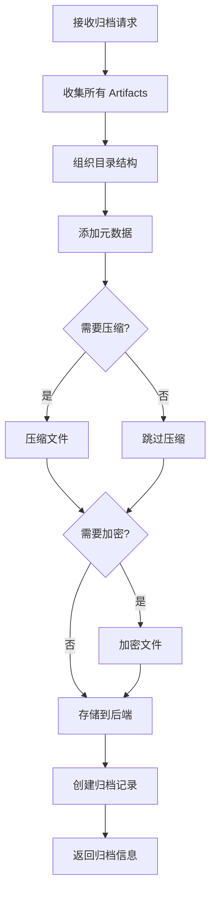
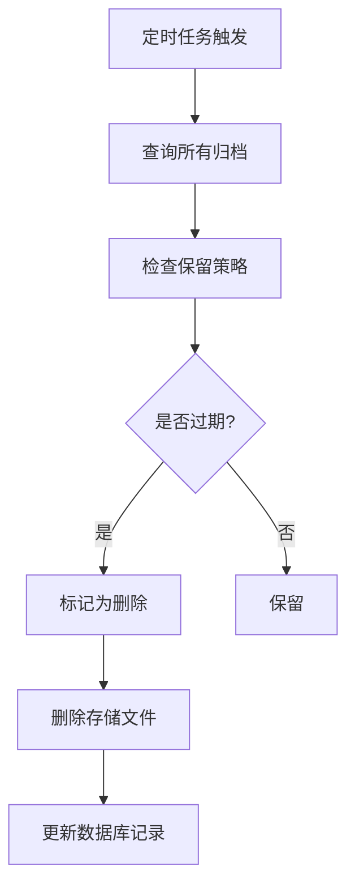

# ADR 0024: M14 归档模块设计

## 状态

设计中

## 上下文

M14 负责项目完成后的归档工作，包括数据存储、清理、导出和长期管理，确保系统资源合理利用。

## 模块职责

### 核心功能

1. **Artifact 存储**
   - 分类存储各阶段 Artifact
   - 元数据索引
   - 访问权限管理

2. **项目归档**
   - 完整项目打包
   - 压缩和加密
   - 归档策略执行

3. **数据清理**
   - 临时文件清理
   - 过期数据删除
   - 存储空间回收

4. **导出功能**
   - 多种导出格式
   - 可配置导出内容
   - 批量导出支持

5. **长期管理**
   - 归档数据检索
   - 版本管理
   - 数据迁移

## 数据模型

### Archive 表

```sql
CREATE TABLE archives (
    id UUID PRIMARY KEY,
    project_id UUID REFERENCES projects(id),
    job_id UUID REFERENCES jobs(id),
    batch_id UUID REFERENCES batch_projects(id),

    -- 归档信息
    archive_type VARCHAR(50) NOT NULL, -- 'project' | 'job' | 'batch'
    storage_path TEXT NOT NULL,
    storage_backend VARCHAR(20) DEFAULT 'local', -- 'local' | 's3' | 'azure' | 'gcs'

    -- 内容信息
    included_artifacts JSONB NOT NULL,
    total_size_bytes BIGINT NOT NULL,
    file_count INTEGER NOT NULL,

    -- 压缩和加密
    compressed BOOLEAN DEFAULT TRUE,
    compression_ratio FLOAT,
    encryption_algorithm VARCHAR(50),
    encrypted BOOLEAN DEFAULT FALSE,

    -- 保留策略
    retention_policy VARCHAR(50),
    expires_at TIMESTAMP,

    -- 状态
    status VARCHAR(20) DEFAULT 'archived', -- 'archived' | 'expired' | 'deleted'
    created_at TIMESTAMP DEFAULT CURRENT_TIMESTAMP,
    deleted_at TIMESTAMP
);
```

### ArchiveStorage 表（存储后端配置）

```sql
CREATE TABLE archive_storage (
    id UUID PRIMARY KEY,
    user_id UUID REFERENCES users(id),

    -- 后端配置
    backend_type VARCHAR(20) NOT NULL,
    config JSONB NOT NULL,

    -- 容量信息
    capacity_bytes BIGINT,
    used_bytes BIGINT DEFAULT 0,

    -- 状态
    status VARCHAR(20) DEFAULT 'active',
    priority INTEGER DEFAULT 0,

    created_at TIMESTAMP DEFAULT CURRENT_TIMESTAMP,
    updated_at TIMESTAMP DEFAULT CURRENT_TIMESTAMP
);
```

### ArchiveExport 表

```sql
CREATE TABLE archive_exports (
    id UUID PRIMARY KEY,
    archive_id UUID REFERENCES archives(id),
    user_id UUID REFERENCES users(id),

    -- 导出信息
    export_format VARCHAR(20) NOT NULL, -- 'zip' | 'tar' | 'folder'
    destination_type VARCHAR(20) NOT NULL, -- 'download' | 'external' | 'cloud'
    destination_config JSONB,

    -- 内容筛选
    filter_config JSONB,

    -- 状态
    status VARCHAR(20) DEFAULT 'pending',
    progress FLOAT DEFAULT 0,
    file_path TEXT,

    created_at TIMESTAMP DEFAULT CURRENT_TIMESTAMP,
    completed_at TIMESTAMP
);
```

## 算法设计

### 归档打包

```python
def create_project_archive(project_id, config):
    """
    创建项目归档

    Args:
        project_id: 项目 ID
        config: 归档配置

    Returns:
        Archive: 归档信息
    """
    # 1. 收集所有相关数据
    artifacts = collect_project_artifacts(project_id)
    metadata = extract_project_metadata(project_id)

    # 2. 组织目录结构
    archive_structure = organize_archive_structure(
        artifacts,
        metadata,
        config.get('structure_template')
    )

    # 3. 创建临时目录
    temp_dir = create_temp_directory()

    # 4. 复制文件到临时目录
    for item in archive_structure:
        copy_to_archive(item.source, temp_dir / item.target)

    # 5. 添加元数据文件
    write_metadata_file(temp_dir / 'metadata.json', metadata)

    # 6. 压缩（如果启用）
    if config.get('compress', True):
        archive_file = compress_directory(temp_dir, config.get('compression'))
    else:
        archive_file = move_directory(temp_dir)

    # 7. 加密（如果启用）
    if config.get('encrypt', False):
        archive_file = encrypt_file(
            archive_file,
            config.get('encryption_key'),
            config.get('encryption_algorithm')
        )

    # 8. 存储到后端
    storage_path = store_to_backend(
        archive_file,
        config.get('storage_backend')
    )

    # 9. 创建归档记录
    archive = Archive(
        project_id=project_id,
        storage_path=storage_path,
        included_artifacts=[a.id for a in artifacts],
        total_size_bytes=get_file_size(archive_file),
        file_count=len(artifacts),
        compressed=config.get('compress', True),
        encrypted=config.get('encrypt', False)
    )
    archive.save()

    return archive
```

### 保留策略执行

```python
class RetentionPolicyExecutor:
    """保留策略执行器"""

    POLICIES = {
        'forever': lambda a: False,
        '30days': lambda a: (now() - a.created_at) > timedelta(days=30),
        '90days': lambda a: (now() - a.created_at) > timedelta(days=90),
        '1year': lambda a: (now() - a.created_at) > timedelta(days=365),
        'custom': lambda a: a.expires_at and a.expires_at < now()
    }

    def __init__(self, storage_backend):
        self.storage = storage_backend

    def execute_policy(self, archive):
        """执行保留策略"""
        policy = archive.retention_policy

        # 检查是否过期
        should_delete = self.POLICIES[policy](archive)

        if should_delete:
            # 标记为删除
            archive.status = 'deleted'
            archive.deleted_at = now()
            archive.save()

            # 删除实际文件
            self.storage.delete(archive.storage_path)

            return True

        return False

    def cleanup_expired(self):
        """清理所有过期归档"""
        expired = Archive.query.filter_by(status='archived').all()

        deleted_count = 0
        for archive in expired:
            if self.execute_policy(archive):
                deleted_count += 1

        return deleted_count
```

### 导出处理器

```python
class ArchiveExporter:
    """归档导出器"""

    def __init__(self, archive, config):
        self.archive = archive
        self.config = config

    def export(self):
        """执行导出"""
        # 1. 从存储获取归档文件
        archive_file = self.archive.retrieve_from_storage()

        # 2. 解密（如果加密）
        if self.archive.encrypted:
            archive_file = decrypt_file(
                archive_file,
                self.config.get('decryption_key')
            )

        # 3. 解压（如果压缩）
        if self.archive.compressed:
            temp_dir = decompress_file(archive_file)
        else:
            temp_dir = archive_file

        # 4. 应用过滤器
        if self.config.get('filter'):
            temp_dir = apply_filter(temp_dir, self.config['filter'])

        # 5. 按目标格式输出
        if self.config['destination_type'] == 'download':
            return self._prepare_download(temp_dir)
        elif self.config['destination_type'] == 'external':
            return self._export_to_external(temp_dir)
        elif self.config['destination_type'] == 'cloud':
            return self._upload_to_cloud(temp_dir)

    def _prepare_download(self, source_dir):
        """准备下载"""
        # 打包成指定格式
        if self.config['export_format'] == 'zip':
            output_file = create_zip(source_dir)
        elif self.config['export_format'] == 'tar':
            output_file = create_tar(source_dir)
        else:
            output_file = source_dir

        return {
            'type': 'download',
            'file_path': output_file,
            'size_bytes': get_file_size(output_file)
        }

    def _export_to_external(self, source_dir):
        """导出到外部位置"""
        external_config = self.config['destination_config']

        if external_config['type'] == 'sftp':
            upload_sftp(source_dir, external_config)
        elif external_config['type'] == 'webdav':
            upload_webdav(source_dir, external_config)

        return {
            'type': 'external',
            'destination': external_config['location']
        }
```

## API 设计

### 创建归档

```http
POST /api/projects/{project_id}/archive
Content-Type: application/json

{
    "retention_policy": "90days",
    "storage_backend": "s3",
    "compress": true,
    "encrypt": false,
    "include_artifacts": "all"
}
```

### 列出归档

```http
GET /api/archives
Query Parameters:
  - project_id: 筛选项目
  - status: 筛选状态
  - retention_policy: 筛选保留策略
```

响应:
```json
{
    "archives": [
        {
            "id": "arc_001",
            "project_id": "proj_001",
            "storage_path": "s3://bucket/archives/proj_001.zip",
            "total_size_bytes": 123456789,
            "file_count": 42,
            "retention_policy": "90days",
            "status": "archived",
            "created_at": "2024-01-01T00:00:00Z"
        }
    ]
}
```

### 导出归档

```http
POST /api/archives/{archive_id}/export
Content-Type: application/json

{
    "export_format": "zip",
    "destination_type": "download",
    "filter": {
        "include_artifact_types": ["M10_SynthesizedAudio", "M11_FinalVideo"]
    }
}
```

### 获取下载链接

```http
GET /api/archives/{archive_id}/download-url
```

### 删除归档

```http
DELETE /api/archives/{archive_id}
```

## 工作流程

### 归档流程



### 清理流程



## 输入输出

### 输入

- 项目/Job/批次 ID
- 归档配置

### 输出

- 归档文件
- 下载链接
- 导出结果

## 依赖模块

- **所有模块**: 生成需要归档的 Artifact

## 质量保证

### 验证规则

1. 完整性: 所有 Artifact 都被正确归档
2. 可恢复性: 归档可以正确解压和恢复
3. 安全性: 加密归档数据安全

### 质量指标

- 归档成功率
- 压缩效率
- 恢复成功率

## 存储策略

| 策略 | 描述 | 适用场景 |
|------|------|----------|
| forever | 永久保留 | 重要项目 |
| 30days | 保留30天 | 临时项目 |
| 90days | 保留90天 | 一般项目 |
| 1year | 保留1年 | 长期项目 |
| custom | 自定义 | 特殊需求 |

## 性能优化

1. 后台处理: 归档任务在后台异步执行
2. 增量归档: 只归档新增内容
3. 并行处理: 多个归档任务并行执行
4. 存储分层: 热数据/温数据/冷数据分层存储
